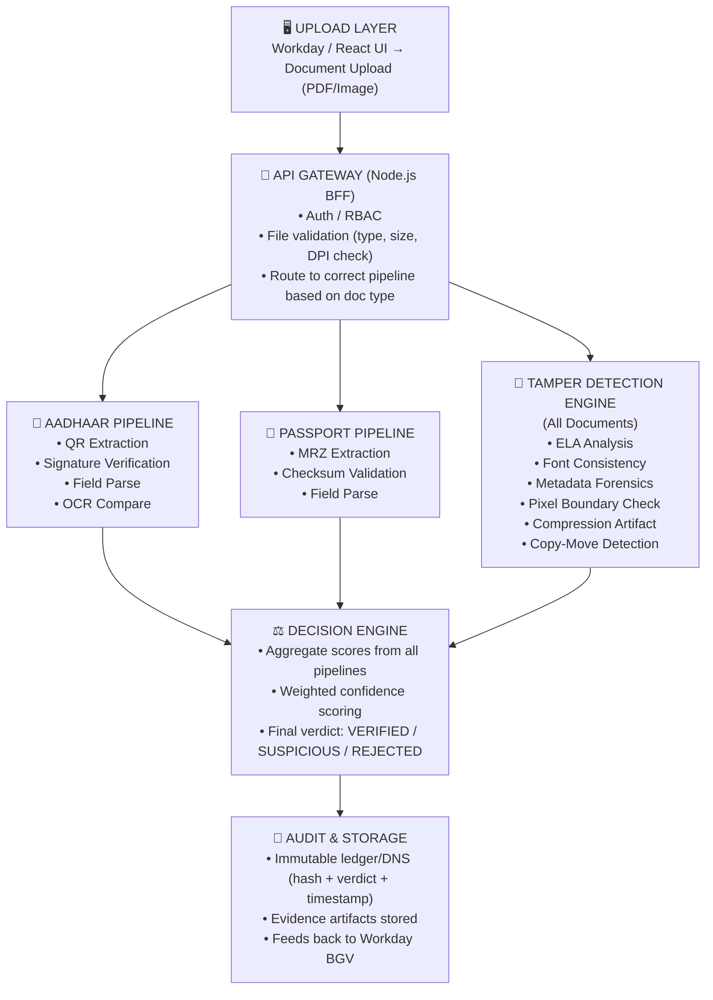
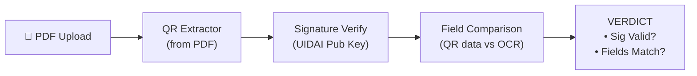
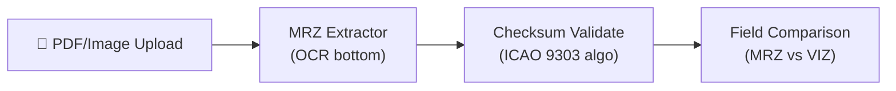
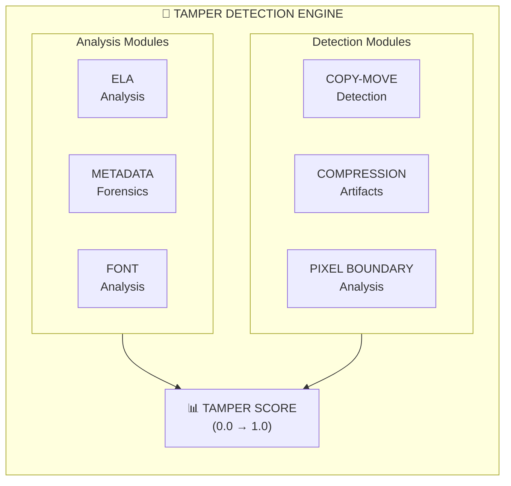
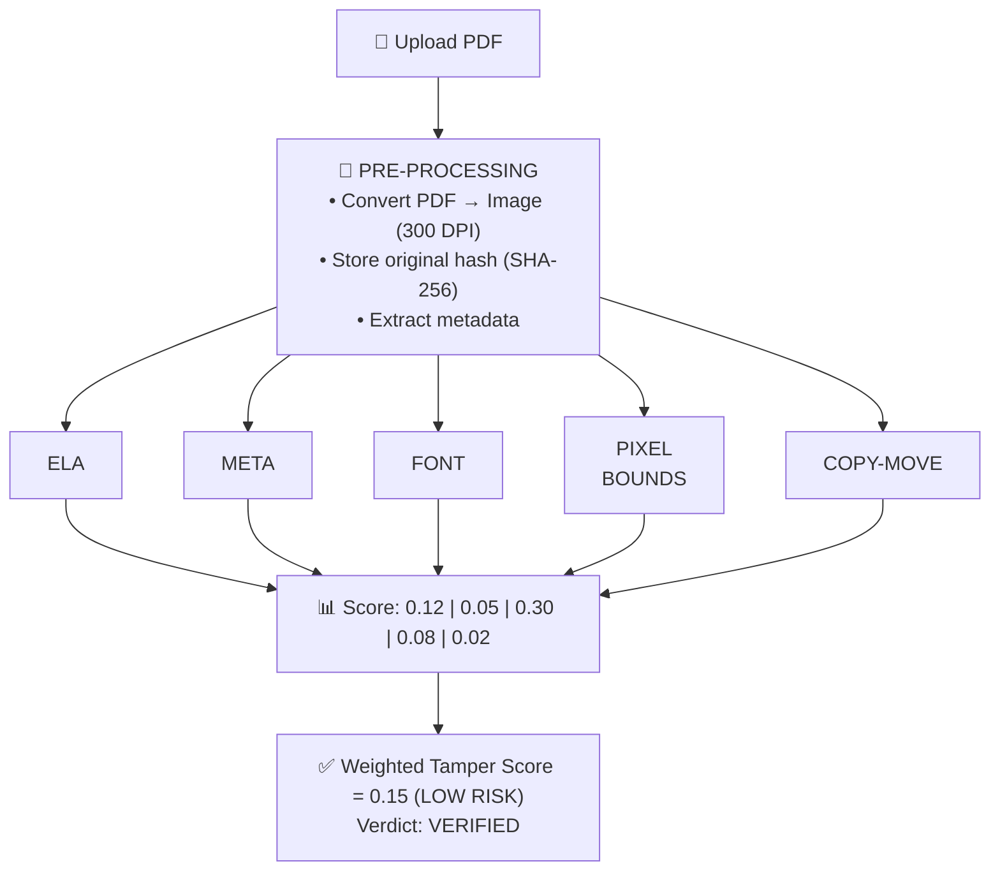
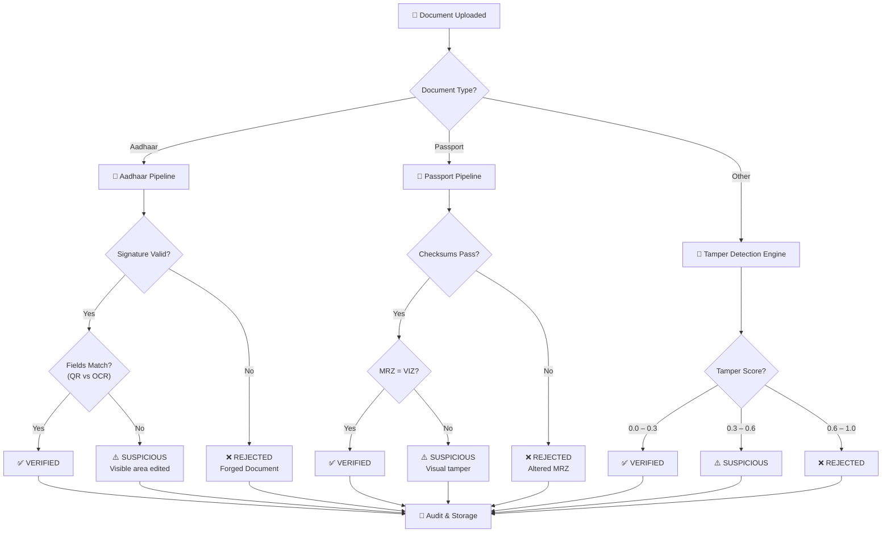

# 📄 Document Verification & Tamper Detection — Architecture Design

> **BGV (Background Verification) Engine** for automated document authenticity validation  
> Supports identity documents (Aadhaar, Passport) and general documents (degrees, payslips, experience letters, offer letters)

---

## 📋 Table of Contents

- [Scope](#-scope)
- [High-Level Architecture](#-high-level-architecture)
- [Pipeline 1: Aadhaar Verification](#-pipeline-1-aadhaar-verification)
- [Pipeline 2: Passport Verification](#-pipeline-2-passport-verification)
- [Pipeline 3: Tamper Detection Engine (Universal)](#-pipeline-3-tamper-detection-engine-universal)
  - [A. Error Level Analysis (ELA)](#a-error-level-analysis-ela)
  - [B. Metadata Forensics](#b-metadata-forensics)
  - [C. Font Consistency Analysis](#c-font-consistency-analysis)
  - [D. Pixel Boundary Analysis](#d-pixel-boundary-analysis)
  - [E. Compression Artifact Analysis](#e-compression-artifact-analysis)
  - [F. Copy-Move Detection](#f-copy-move-detection)
- [Processing Flow Example](#-processing-flow--example-experience-certificate)
- [Output — Verification Artifact](#-output--verification-artifact)
- [Technology Stack](#-technology-stack)
- [Security & Compliance](#-security--compliance)

---

## 🎯 Scope

| Category              | Documents                                           | Approach                                |
|-----------------------|-----------------------------------------------------|-----------------------------------------|
| **Identity**          | Aadhaar, Passport                                   | Cryptographic + Structural Validation   |
| **Tamper Detection**  | Degree, Payslip, Experience Letter, Any PDF/Image   | Image Forensics + ML                    |

---

## 🏗 High-Level Architecture



---

## 📘 PIPELINE 1: Aadhaar Verification

### Flow



### Validation Checks

| # | Check | Detects |
|---|-------|---------|
| 1 | QR RSA-SHA256 signature vs UIDAI public key | Forged QR / fake Aadhaar |
| 2 | QR parsed name vs OCR extracted name | Text tampering on visible area |
| 3 | QR DOB vs OCR DOB | DOB manipulation |
| 4 | QR gender vs OCR gender | Field alteration |
| 5 | QR photo vs face on document | Photo swap |

### Decision Logic

```
IF signature_valid AND all_fields_match → ✅ VERIFIED
IF signature_valid AND fields_mismatch → ⚠️ SUSPICIOUS (visible area edited)
IF signature_invalid                   → ❌ REJECTED (forged document)
```

---

## 📗 PIPELINE 2: Passport Verification

### Flow



### MRZ Checksum Validation (ICAO 9303 Standard)

```
Line 1: P<INDLASTNAME<<FIRSTNAME<<<<<<<<<<<<<<<<<<<<
Line 2: A1234567<8IND9001011M3012315<<<<<<<<<<<<<<4

        ├──────┤▲ ├────┤▲  ├──────┤▲              ▲
        Passport#│  DOB │   Expiry │              │
            Check    Check      Check     Composite
            Digit    Digit      Digit     Check Digit
```

### Validation Checks

| # | Check | Detects |
|---|-------|---------|
| 1 | MRZ check digit — passport number | Number manipulation |
| 2 | MRZ check digit — DOB | DOB tampering |
| 3 | MRZ check digit — expiry date | Validity extension fraud |
| 4 | Composite check digit | Any field alteration |
| 5 | MRZ name vs VIZ (visual) name (OCR) | Name change on visible area |
| 6 | MRZ DOB vs VIZ DOB | DOB inconsistency |

### Decision Logic

```
IF all_checksums_pass AND MRZ_matches_VIZ → ✅ VERIFIED
IF checksum_fails                         → ❌ REJECTED (altered MRZ)
IF checksum_pass BUT MRZ ≠ VIZ            → ⚠️ SUSPICIOUS (visual tamper)
```

---

## 📕 PIPELINE 3: Tamper Detection Engine (Universal)

> **Applies to:** Degree certificates, Payslips, Experience letters, Offer letters, Any uploaded document

### Sub-Modules Overview



---

### 🔬 Module Details

#### A. Error Level Analysis (ELA)

> **Purpose:** Detect regions re-saved at different JPEG quality levels

**How it works:**
1. Re-save image at known quality (e.g., 95%)
2. Compute pixel difference between original and re-saved
3. Uniform difference = untouched
4. Bright spots in difference = edited regions

**Detects:**
- Photoshop edits
- Pasted text/numbers
- Logo replacements
- Photo swaps

---

#### B. Metadata Forensics

> **Purpose:** Extract and analyze document metadata for signs of tampering

**Extract and analyze:**

| Field | Red Flag |
|-------|----------|
| Creator tool | Photoshop, GIMP |
| Modification date | After creation |
| PDF Producer | Online PDF editors |
| XMP history | Edit operations |
| Font embedding | Partial/missing |
| Page count change | Inserted pages |

**High-risk signals:**
- `"Adobe Photoshop"` as creator
- `ModDate ≠ CreateDate`
- `"Canva"` / `"iLovePDF"` / `"SmallPDF"` as producer
- Multiple software in creation chain

---

#### C. Font Consistency Analysis

> **Purpose:** Detect if text was added/modified using different fonts

**How it works:**
1. OCR with character-level bounding boxes
2. Extract font metrics per character:
   - Stroke width
   - Character spacing
   - Baseline alignment
   - Serif presence
3. Cluster fonts across document
4. Flag regions with inconsistent font profile

**Detects:**
- Name/date edited with different font
- Overlaid text on scanned documents
- Digital text added to image-based PDFs

---

#### D. Pixel Boundary Analysis

> **Purpose:** Detect sharp boundaries where edits were pasted

**How it works:**
1. Convert to grayscale
2. Apply edge detection (Sobel/Canny)
3. Identify rectangular regions with unnatural edges
4. Check if boundaries align with text/number regions

**Detects:**
- Copy-pasted salary figures
- Replaced dates
- Overlaid logos/stamps

---

#### E. Compression Artifact Analysis

> **Purpose:** Detect double-compression (edit → save → edit → save)

**How it works:**
1. Analyze JPEG block boundaries (8×8 DCT blocks)
2. Detect ghost grid misalignment
3. Different compression levels in same image = tampering

**Detects:**
- Regions saved at different quality
- Screenshots pasted into documents
- Mixed-origin content

---

#### F. Copy-Move Detection

> **Purpose:** Detect duplicated regions (clone stamp / copy-paste)

**How it works:**
1. Divide image into overlapping blocks
2. Compute feature vector per block (DCT/PCA)
3. Find matching block pairs
4. Filter out natural repetitions (background)

**Detects:**
- Cloned signatures
- Duplicated stamps/seals
- Copied text blocks

---

## 🔄 Processing Flow — Example: Experience Certificate



### Score Thresholds

| Score Range | Risk Level | Verdict |
|-------------|------------|---------|
| 0.00 – 0.30 | 🟢 LOW | ✅ VERIFIED |
| 0.31 – 0.60 | 🟡 MEDIUM | ⚠️ SUSPICIOUS |
| 0.61 – 1.00 | 🔴 HIGH | ❌ REJECTED |

---

## 📦 Output — Verification Artifact

```json
{
  "documentId": "DOC-2026-0617-XYZ",
  "docType": "EXPERIENCE_CERTIFICATE",
  "uploadedBy": "candidate_123",
  "timestamp": "2026-06-17T10:30:00Z",
  "originalHash": "sha256:a1b2c3d4...",
  "verification": {
    "verdict": "SUSPICIOUS",
    "confidenceScore": 62,
    "flags": [
      {
        "module": "ELA",
        "severity": "HIGH",
        "description": "Bright region detected around salary field",
        "coordinates": { "x": 320, "y": 580, "w": 200, "h": 40 }
      },
      {
        "module": "METADATA",
        "severity": "MEDIUM",
        "description": "Creator: Adobe Photoshop CC 2024"
      }
    ]
  },
  "auditTrail": {
    "processedAt": "2026-06-17T10:30:05Z",
    "engine": "tamper-detection-v2.1",
    "certUsed": "uidai_offline_publickey_2026.cer"
  }
}
```

---

## 🧩 Technology Stack

| Layer | Technology | Why |
|-------|-----------|-----|
| API Gateway | Node.js / Express | BFF pattern, routing |
| QR Decode | Sharp + jsQR | Image processing + QR |
| Signature Verify | Node.js `crypto` | RSA-SHA256, built-in |
| MRZ Parse | Custom parser | ICAO 9303 spec |
| OCR | Tesseract.js / Azure Form Recognizer | Text extraction |
| ELA Engine | Python (Pillow/OpenCV) | Image forensics |
| Font Analysis | Python (OpenCV + ML model) | Pattern recognition |
| Copy-Move | Python (scikit-image) | Feature matching |
| ML Model | TensorFlow/PyTorch | Trained on forged vs genuine |
| Storage | S3 + DynamoDB / PostgreSQL | Immutable audit |
| Orchestration | Step Functions / Bull Queue | Pipeline management |

---

## 🛡️ Security & Compliance

- 🔒 **PII encrypted at rest** (AES-256)
- 🗑️ **Documents auto-purged** after BGV complete
- 👥 **RBAC:** Only BGV team sees full documents
- 👤 **Candidate sees only verdict**, not details
- 📜 **Immutable audit log** (append-only)
- 🔑 **All API calls authenticated** (OAuth 2.0)

---

## 📐 System Decision Flow — Summary



---

## 📁 Project Structure (Proposed)

```
bgv-document-verification/
├── README.md
├── package.json
├── docker-compose.yml
│
├── gateway/                     # Node.js API Gateway
│   ├── src/
│   │   ├── routes/
│   │   ├── middleware/          # Auth, RBAC, validation
│   │   └── index.ts
│   └── package.json
│
├── pipelines/
│   ├── aadhaar/                 # Pipeline 1
│   │   ├── qr-extractor.ts
│   │   ├── signature-verify.ts
│   │   ├── field-compare.ts
│   │   └── index.ts
│   │
│   ├── passport/                # Pipeline 2
│   │   ├── mrz-parser.ts
│   │   ├── checksum-validator.ts
│   │   ├── field-compare.ts
│   │   └── index.ts
│   │
│   └── tamper-detection/        # Pipeline 3
│       ├── ela.py
│       ├── metadata-forensics.py
│       ├── font-analysis.py
│       ├── pixel-boundary.py
│       ├── compression-artifact.py
│       ├── copy-move.py
│       └── score-aggregator.py
│
├── decision-engine/             # Verdict computation
│   ├── scorer.ts
│   └── rules.ts
│
├── storage/                     # Audit & storage
│   ├── audit-logger.ts
│   └── s3-client.ts
│
├── certs/                       # UIDAI public keys
│   └── uidai_auth_sign_Prod_2026.cer
│
├── ml-models/                   # Trained models
│   └── forged-vs-genuine/
│
└── tests/
    ├── aadhaar.test.ts
    ├── passport.test.ts
    └── tamper.test.ts
```

---

## 🚀 Getting Started

```bash
# Clone the repository
git clone <repo-url>
cd bgv-document-verification

# Create and activate a virtual environment (Windows)
python -m venv venv
.\venv\Scripts\activate

# Install dependencies
pip install -r requirements.txt

# Run the Flask backend and static frontend
python server.py
```

The application will be available at `http://localhost:5000`. The frontend is served statically by Flask from the `public` directory.

---

## 📄 License

Internal use only — Proprietary BGV System

---

> **Engine Version:** tamper-detection-v2.1  
> **Last Updated:** June 2026
